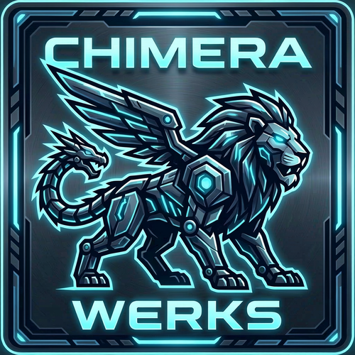

  

<h1 align="center">Chimera Werks</h1>

  <strong>AI-native tools for creators who generate at scale.</strong>

---

## About

Chimera Werks is a software studio founded in 2026, focused on building infrastructure for the AI-generated media workflow. We solve the problems that emerge when creators move past their first hundred outputs and into the thousands — where existing tools break down, metadata gets lost, and creative momentum stalls.

Our approach: treat AI-generated content as structured data, not just files. Extract it, decompose it, index it, and make every parameter searchable. Then wrap it in interfaces built for the speed and scale that generative AI demands.

---

## Chimera Studio

  

Our flagship product. A local-first media platform that extracts, decomposes, and indexes embedded workflow metadata from AI-generated images, videos, and audio — then serves it through a high-performance browser UI.

**What makes it different:**

- **Deep metadata decomposition** — Not raw JSON dumps. Every workflow parameter — prompts, models, LoRAs, samplers, seeds, schedulers — broken into discrete, indexed, filterable fields. 80+ ComfyUI node types parsed, plus A1111, SwarmUI, InvokeAI, NovelAI, and sidecar JSON formats.

- **Built for scale** — Virtualized rendering handles 10,000+ items at 60fps. Cascading filters update in real time. Incremental scanning means adding 50 files to a library of 10,000 takes seconds, not minutes.

- **Unified experience** — Images, video, and AI audio managed through one interface. Same grid, same filters, same keyboard navigation. Two isolated subsystems (Vault + Music), each with its own database, sharing a single backend.

- **Local-first architecture** — SQLite databases, local file storage, zero cloud dependencies. Optional Cloudflare tunnel when you need remote access. Your data never leaves your machine.

- **Multi-user ready** — JWT authentication, role-based access control, per-user permission overrides, and folder-level restrictions. Built for shared studios from day one.

### Stack

`Python` `FastAPI` `SQLAlchemy` `SQLite` `React` `TypeScript` `Vite` `Tailwind CSS` `Zustand`

---

## Philosophy

Most AI tools focus on generation. We focus on what happens after — the growing library of outputs that no one has good tooling for. File browsers weren't built for this. Platform UIs only manage their own formats. There's a gap between "generate" and "find that thing I made three weeks ago," and that's where we build.

We design for:
- **Performance over features** — Every interaction should feel instant. If it doesn't, it's a bug.
- **Structure over blobs** — Raw metadata is useless at scale. Decomposed, indexed fields are searchable.
- **Local over cloud** — Creators shouldn't need accounts, subscriptions, or internet access to manage their own work.

---

## Contact

  <a href="mailto:hello@chimerawerks.com"><strong>hello@chimerawerks.com</strong></a>

  Chimera Werks &mdash; 2026

