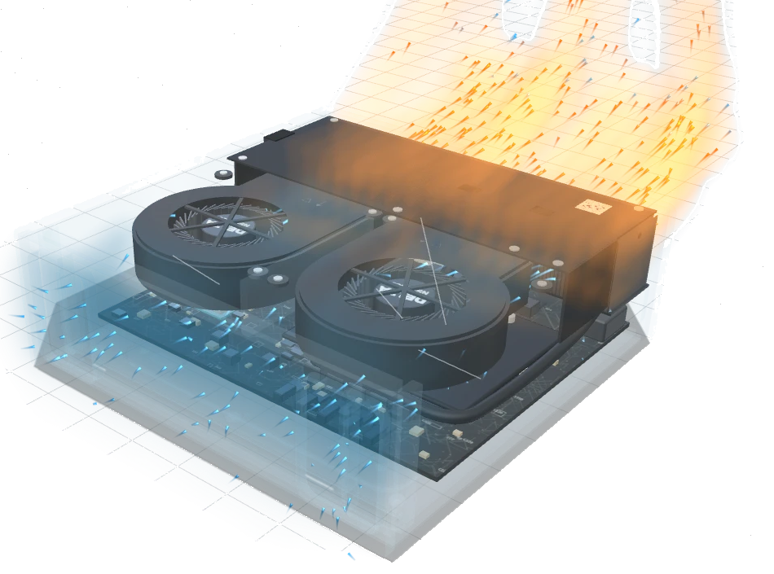

# Chimera Werks

 

---

### Hey, I'm the person behind Chimera Werks

A chimera is one animal built from parts that shouldn't go together, which is roughly my career.

My day job is finance director: budgets, forecasts, and numbers that have to be right the first time. Everything else goes into building AI systems, which is the part I'd happily do for free.

Most of it runs on hardware on my desk, because I'd rather not trust someone else's cloud to remember my work for me.

## What I'm building

### 🍳 [sparkKitchen](https://github.com/ChimeraWerks/sparkKitchen)

*Plan, serve and watch AI models on your NVIDIA DGX Spark and GB10 cluster.*

I run three DGX Sparks, and sparkKitchen is the dashboard I built to keep an eye on them. It lives on your desktop, checks in on every node over SSH, and never installs or changes anything on the cluster.

- Shows what's serving where, with live vLLM, SGLang and llama.cpp throughput, KV cache and latency.
- Works out how much memory a model really needs, layer by layer from its architecture, before you try to load it.
- Tracks GPU clocks, temperatures, throttling and RDMA fabric traffic every second, with two weeks of history.
- Notices when a running container has drifted from the recipe you wrote for it.
- Ranks new models by whether they'll actually fit on your nodes.
- Includes a 3D model of the Spark with a live heat and airflow simulation. That's it on the right.

Open source under Apache-2.0.

 

### ⛩️ Shikigami

*One daemon that lets any AI harness drive any other.*

Shikigami runs a resident daemon with a single MCP surface registered in every harness I use, so an agent in one app can open a session in another, send it a prompt, watch it work and bring the answer back. Any app can be the caller or the target.

It drives the real, headed desktop apps rather than headless terminal sessions. Every turn plays out in a window you can watch, and each app keeps its desktop-only features: artifacts, previews, attachments and its own tools. Every call has a named owner, every reply is saved with a hash, and nothing ever closes the app you're working in.

**private · running daily**

### 🎬 Chimera Studio

*My full pipeline for image and video generation, and for keeping everything it makes organized.*

- **Vault**: scans every folder of generated media, pulls the workflow, prompt and model out of each file, and makes years of output searchable and taggable.
- **Image and video workbenches**: browse and run versioned ComfyUI workflows with the models, LoRAs and recipes they need, including MiniMax H3 video.
- **Custom node manager**: shows every installed node, where it came from and which workflows use it, and warns before an update breaks one.

**private · primary product · used every day**

## Stack I reach for

<table>
  <tr>
    <td><b>Languages</b></td>
    <td>   </td>
  </tr>
  <tr>
    <td><b>Apps</b></td>
    <td>     </td>
  </tr>
  <tr>
    <td><b>AI & agents</b></td>
    <td>     </td>
  </tr>
  <tr>
    <td><b>Inference</b></td>
    <td>   </td>
  </tr>
  <tr>
    <td><b>Hardware</b></td>
    <td>  </td>
  </tr>
  <tr>
    <td><b>Infra</b></td>
    <td>     </td>
  </tr>
</table>

---

Say hi: **[hello@chimerawerks.com](mailto:hello@chimerawerks.com)**

Three heads, two hands, one very patient keyboard.

