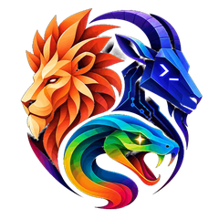
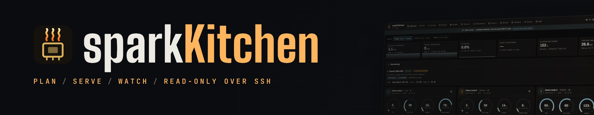
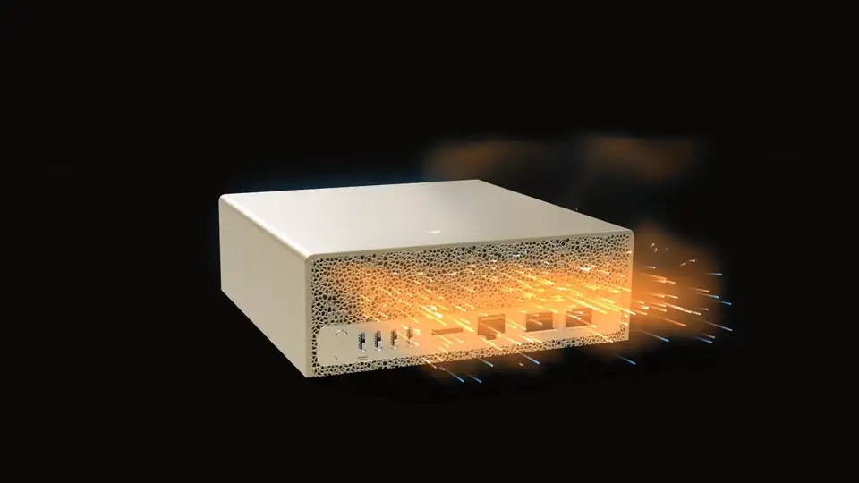
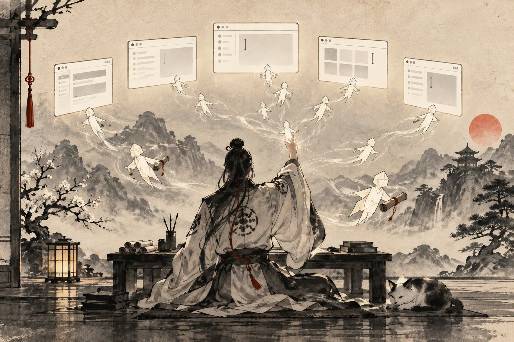
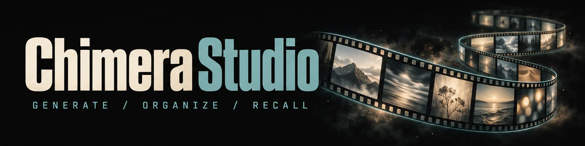
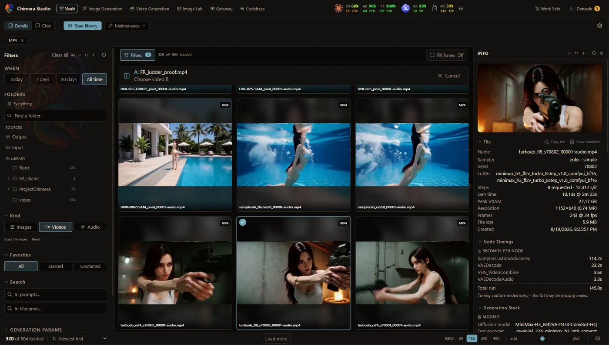

# Chimera Werks

**Local-first AI infrastructure, built on hardware on my desk.**

 

---

### Hey, I'm the person behind Chimera Werks

A chimera is one animal built from parts that shouldn't go together, which is roughly my career.

My day job is finance director: budgets, forecasts, and numbers that have to be right the first time. Everything else goes into building AI systems, which is the part I'd happily do for free.

Most of it runs on hardware on my desk, because I'd rather not trust someone else's cloud to remember my work for me.

## What I'm building

*Plan, serve and watch AI models on your NVIDIA DGX Spark and GB10 cluster.*

<b>Alpha · open source under Apache-2.0</b>

<picture><source media="(prefers-reduced-motion: reduce)" srcset="assets/sparkkitchen-3d-lab.jpg"></picture>

I run three DGX Sparks, and sparkKitchen is the dashboard I built to keep an eye on them.

- **Hands off the cluster**: it lives on your desktop, checks in on every node over SSH, and never starts, stops or reconfigures anything there.
- **Serving**: what's running where, with live vLLM, SGLang and llama.cpp throughput, KV cache and latency.
- **Memory**: how much a model really needs, layer by layer from its architecture, before you try to load it.
- **Sensors**: GPU clocks, temperatures, throttling and RDMA fabric traffic every second, with two weeks of history.
- **Recipes and models**: flags a container that has drifted from its recipe, and ranks new models by whether they'll fit.
- **3D lab**: a model of the Spark with a live heat and airflow simulation. That's it above.

*One daemon that lets any AI harness drive any other.*

<b>Running daily · public release coming soon</b>

Shikigami runs a resident daemon with a single MCP surface, registered in every harness I use: Claude Desktop, Codex Desktop, Hermes, Antigravity and DeepSeek Harness.

- **Any app drives any other**: an agent in one app opens a session in another, sends it a prompt, watches it work and brings the answer back. Any app can be the caller or the target.
- **Real desktop apps**: every turn plays out in a window you can watch, not a headless terminal session.
- **Nothing lost**: each app keeps its desktop-only features, such as artifacts, previews, attachments and its own tools.
- **Accountable**: every call has a named owner, every reply is saved with a hash, and nothing ever closes the app you're working in.

*My full pipeline for image and video generation, and for keeping everything it makes organized.*

<b>Primary product · used every day · public release coming soon</b>

- **Vault**: scans every folder of generated media, pulls the workflow, prompt and model out of each file, and makes years of output searchable and taggable.
- **Image and video workbenches**: browse and run versioned ComfyUI workflows with the models, LoRAs and recipes they need, including MiniMax H3 video.
- **Custom node manager**: shows every installed node, where it came from and which workflows use it, and warns before an update breaks one.

## Stack I reach for

<table>
  <tr>
    <td><b>Languages</b></td>
    <td>   </td>
  </tr>
  <tr>
    <td><b>Apps</b></td>
    <td>     </td>
  </tr>
  <tr>
    <td><b>AI & agents</b></td>
    <td>     </td>
  </tr>
  <tr>
    <td><b>Inference</b></td>
    <td>   </td>
  </tr>
  <tr>
    <td><b>Hardware</b></td>
    <td>  </td>
  </tr>
  <tr>
    <td><b>Infra</b></td>
    <td>     </td>
  </tr>
</table>

---

Say hi: **[hello@chimerawerks.com](mailto:hello@chimerawerks.com)**

Three heads, two hands, one very patient keyboard.

